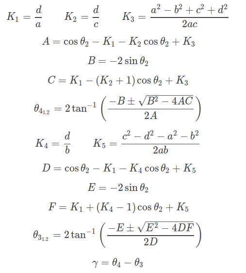

Read the value of link lengths and the input angle θ2, then use the formulae given below to calculate the value of unknowns θ3, θ4 and γ

Additionally, find out the limiting values of position of input link. This is done by finding out the positions beyond which θ3 and/or θ4 don't have a defined value.
For special cases of positioning (e.g. when two link are aligned) use simple geometry and trigonometry relations to find out the solution