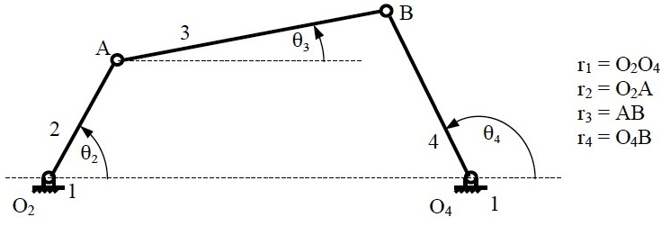
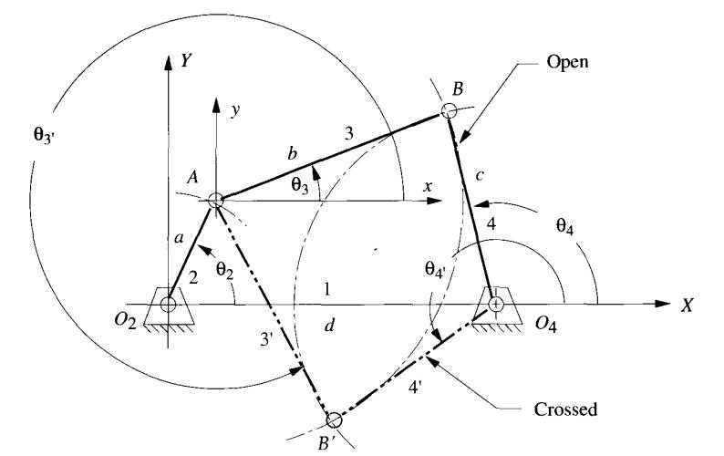

## Learning objectives

After completing the simulation experiments on fourbar Non-Grash of mechanism one should be able to 

* Determine the location CG of any given link in a Non-Grashof four bar mechanism
* Determine the output link angle of a Non-Grashof four bar mechanism for any given crank angle
* Calculate the transmission angle of a given Non-Grashof four bar mechanism at any given crank angle

* Synthesize length of a Non-Grashof four bar mechanism for a given conditions

## Introduction

A four bar mechanism consists of four rigid link which are linked in the form of quadrilateral by four pin joints. A link that makes complete revolution is called crank, the link opposite to the fixed link is the coupler and forth link is a lever or rocker if oscillates or another crank if rotates.

Figure 1: Four bar mechanism

## Position Analysis of Four Bar Mechanism

Figure 2: Nomenclature of four bar mechanism.

**Grashof ’s Law** : For a planar four bar linkage, the sum of the shortest (s) and longest (l) links cannot be greater than the sum of the remaining (p,q) links if there is to be continuous relative rotation between two members.

**Inversions** : A mechanism has been defined above as a kinematic chain in which one of the links is fixed. From the four bar mechanism, different versions of each of them can be obtained by fixing any one of the links p, q, l or s. Such different versions, which can be obtained by fixing any of the different links, are called its “Inversions”. Many a time, a particular inversion of a mechanism may give rise to different mechanisms of practical utility, when the proportions of the link lengths are changed.
By this principle of inversion of a fourbar chain, several useful mechanisms can be obtained. Mainly there are three inversions of four bar mechanisms, which are obtained by fixing different links of the kinematic chain as shown in the figure below. They are:

1. Double Crank Mechanism
2. Crank Rocker Mechanism
3. Double Rocker Mechanism

Figure 3: Inversions of Four bar mechanism

## Determination of Position of any point on FourBar

Figure 4: Configuration of four bar mechanism

By using relations in geometry and trigonometry the position of any point on the four bar mechanism can be found out for a given value of input angle θ2 when the four link lengths are known

At a given value of θ2 there can be two possible configurations of the four bar mechanism as shown in above figure. The following vector loop equation can be used to define the four bar mechanism

Separating the above equation into real and imaginary parts leads to two equations which can be solved to find the value of two unknowns θ3 and θ4

